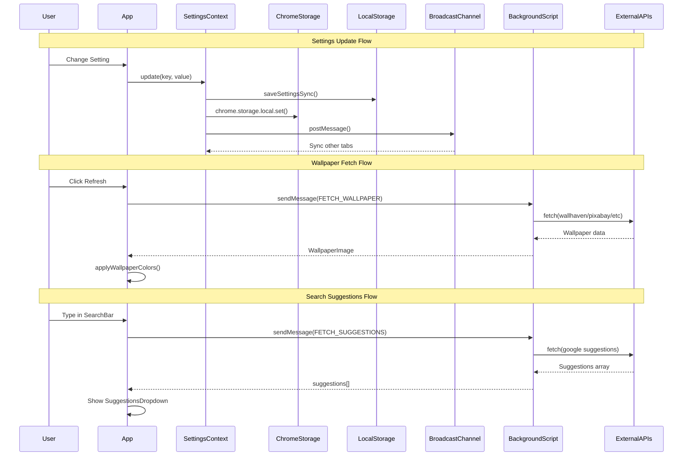
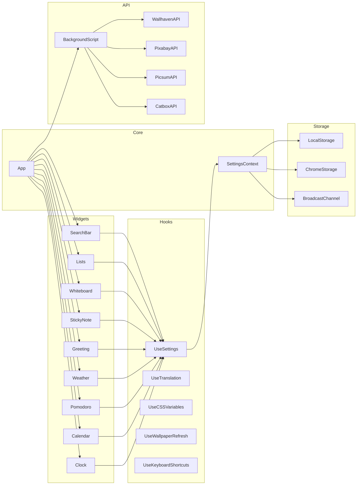

# Chrome New Tab Extension - Knowledge Graph

## Interactive Node Diagram (Mermaid)

```mermaid
graph TB
    %% Entry Points
    HTML[index.html] --> Main[main.tsx]
    Main --> SettingsProvider[SettingsProvider]
    SettingsProvider --> App[App.tsx]

    %% Context & State
    App --> SettingsContext[SettingsContext]
    SettingsContext --> ReactState[React useState]
    SettingsContext --> BroadcastChannel[BroadcastChannel]
    SettingsContext --> ChromeStorage[chrome.storage.local]
    SettingsContext --> LocalStorage[localStorage]

    %% Layout System
    App --> LayoutSystem[Layout System]
    LayoutSystem --> LoadLayout[loadLayout]
    LayoutSystem --> SaveLayout[saveLayout]
    LayoutSystem --> KanbanBoard[Kanban Board - 6 columns]
    LayoutSystem --> Draggable[Draggable Wrapper]

    %% Widget System
    KanbanBoard --> Clock[Clock Widget]
    KanbanBoard --> Calendar[Calendar Widget]
    KanbanBoard --> Pomodoro[Pomodoro Widget]
    KanbanBoard --> Weather[Weather Widget]
    KanbanBoard --> Greeting[Greeting Widget]
    KanbanBoard --> StickyNote[StickyNote Widget]
    KanbanBoard --> Whiteboard[Whiteboard Widget]
    KanbanBoard --> Lists[Lists Widget]
    KanbanBoard --> SearchBar[SearchBar Widget]

    %% API Layer
    App --> APIClient[api/index.ts]
    APIClient --> BackgroundScript[background.ts]
    BackgroundScript --> WallhavenAPI[Wallhaven API]
    BackgroundScript --> PixabayAPI[Pixabay API]
    BackgroundScript --> PicsumAPI[Picsum API]
    BackgroundScript --> CatboxAPI[Catbox API]

    %% Search Flow
    SearchBar --> SuggestionsAPI[Google Suggestions API]
    SuggestionsAPI --> BackgroundScript

    %% Hooks
    App --> Hooks[Custom Hooks]
    Hooks --> UseSettings[useSettings]
    Hooks --> UseTranslation[useTranslation]
    Hooks --> UseCSSVariables[useCSSVariables]
    Hooks --> UseWallpaperRefresh[useWallpaperRefresh]
    Hooks --> UseKeyboardShortcuts[useKeyboardShortcuts]
    Hooks --> UseLists[useLists]
    Hooks --> UseCanvas[useCanvas]

    %% Storage Layers
    UseSettings --> SettingsContext
    UseTranslation --> Translations[translations/]
    UseCSSVariables --> CSSRoot[CSS Root Variables]
    UseWallpaperRefresh --> APIClient

    %% Helpers
    App --> Helpers[helpers/]
    Helpers --> LayoutHelper[layout.ts]
    Helpers --> DarkModeHelper[darkMode.ts]
    Helpers --> WallpaperHelper[wallpaper.ts]
    Helpers --> WeatherHelper[weather.ts]

    %% Types
    App --> Types[types/]
    Types --> SettingsType[Settings]
    Types --> WidgetType[WidgetId]
    Types --> WallpaperType[WallpaperImage]
    Types --> SearchType[SearchEngineKey]

    %% External Services
    WallhavenAPI --> ExternalAPIs[External APIs]
    PixabayAPI --> ExternalAPIs
    PicsumAPI --> ExternalAPIs
    CatboxAPI --> ExternalAPIs
    SuggestionsAPI --> ExternalAPIs

    %% Styling
    App --> Styles[styles/]
    Styles --> BaseCSS[base.css]
    Styles --> LayoutCSS[layout.css]
    Styles --> WallpaperCSS[wallpaper.css]
    Styles --> WidgetsCSS[widgets.css]

    %% Error Handling
    App --> ErrorBoundaries[Error Boundaries]
    ErrorBoundaries --> AppErrorBoundary[AppErrorBoundary]
    ErrorBoundaries --> WidgetErrorBoundary[WidgetErrorBoundary]

    %% Settings Panels
    App --> SettingsPanel[Settings Panel]
    SettingsPanel --> GeneralSettings[GeneralSettings]
    SettingsPanel --> SearchSettings[SearchSettings]
    SettingsPanel --> BackgroundSettings[BackgroundSettings]
    SettingsPanel --> ClockSettings[ClockSettings]
    SettingsPanel --> WeatherSettings[WeatherSettings]
    SettingsPanel --> GreetingSettings[GreetingSettings]
    SettingsPanel --> WidgetToggles[WidgetToggles]

    %% UI Components
    SettingsPanel --> UIComponents[UI Components]
    UIComponents --> Box[Box]
    UIComponents --> Stack[Stack]
    UIComponents --> ToggleSwitch[ToggleSwitch]
    UIComponents --> SettingRow[SettingRow]
    UIComponents --> SettingInput[SettingInput]
    UIComponents --> SettingSelect[SettingSelect]
    UIComponents --> SegmentedControl[SegmentedControl]

    %% Whiteboard Subsystem
    Whiteboard --> WhiteboardCanvas[Canvas]
    Whiteboard --> WhiteboardToolbar[Toolbar]
    Whiteboard --> ColorPicker[ColorPicker]
    Whiteboard --> WhiteboardTools[Tools]

    %% List Subsystem
    Lists --> ListWidget[ListWidget]
    Lists --> ListItem[ListItem]

    %% Search Subsystem
    SearchBar --> EngineGrid[EngineGrid]
    SearchBar --> SuggestionsDropdown[SuggestionsDropdown]

    %% Style Classes
    classDef entryPoint fill:#e1f5fe
    classDef state fill:#f3e5f5
    classDef widget fill:#e8f5e9
    classDef api fill:#fff3e0
    classDef hook fill:#fce4ec
    classDef storage fill:#f5f5f5

    class HTML,Main entryPoint
    class SettingsContext,ReactState,BroadcastChannel,ChromeStorage,LocalStorage state
    class Clock,Calendar,Pomodoro,Weather,Greeting,StickyNote,Whiteboard,Lists,SearchBar widget
    class APIClient,BackgroundScript,WallhavenAPI,PixabayAPI,PicsumAPI,CatboxAPI,SuggestionsAPI api
    class UseSettings,UseTranslation,UseCSSVariables,UseWallpaperRefresh,UseKeyboardShortcuts,UseLists,UseCanvas hook
    class LoadLayout,SaveLayout,KanbanBoard,Draggable storage
```

## Data Flow Diagram

## Component Dependency Graph

## Key Nodes Summary

| Node Type | Count | Description |
|-----------|-------|-------------|
| Entry Points | 3 | index.html, main.tsx, App.tsx |
| Widgets | 9 | Clock, Calendar, Pomodoro, Weather, Greeting, StickyNote, Whiteboard, Lists, SearchBar |
| Custom Hooks | 15+ | useSettings, useTranslation, useCSSVariables, etc. |
| API Services | 5 | Background script + 4 wallpaper APIs |
| Storage Layers | 4 | React state, localStorage, chrome.storage, BroadcastChannel |
| UI Components | 8+ | Box, Stack, ToggleSwitch, SettingRow, etc. |
| Settings Panels | 7 | General, Search, Background, Clock, Weather, Greeting, WidgetToggles |
| Error Boundaries | 2 | AppErrorBoundary, WidgetErrorBoundary |
| External APIs | 5 | Wallhaven, Pixabay, Picsum, Catbox, Google Suggestions |
